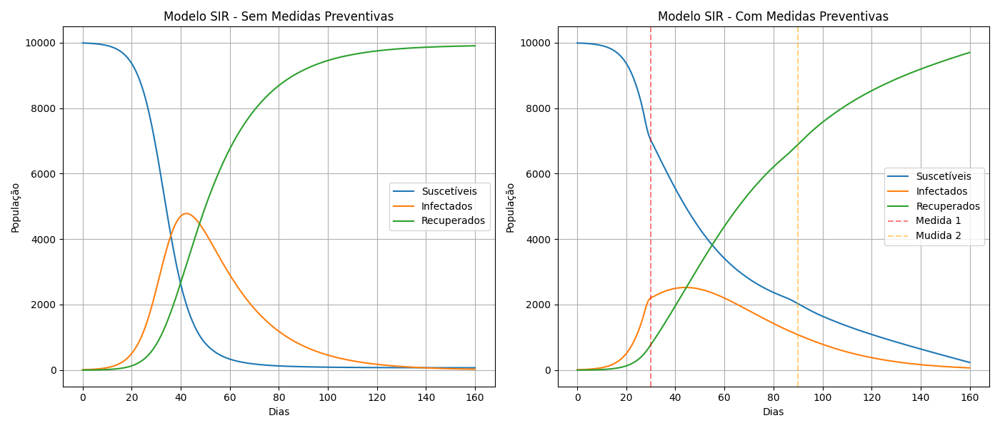

# Projeto Computacional 2 - Modelagem de Epidemias com o Modelo SIR

## Tecnologias Utilizadas

* Linguagem: Python
* Biblioteca: SciPy
* Método numérico: Runge-Kutta de 4ª ordem (RK45)

## Objetivo do Projeto

Modelar a propagação de uma epidemia fictícia utilizando o modelo SIR (Suscetíveis, Infectados, Recuperados) para analisar os impactos de medidas preventivas ao longo do tempo em uma população de 10.000 indivíduos durante um período de 160 dias.

## Configuração Inicial do Modelo

* População total: 10.000 indivíduos
* Dias simulados: 160

### Condições Iniciais:

* S(0): 9990 (Suscetíveis)
* I(0): 10 (Infectados)
* R(0): 0 (Recuperados)

## Cenários Analisados

### 1. Sem Medidas Preventivas

* Taxa de transmissão (B): 0.25
* Taxa de recuperação (Y): 0.05

### 2. Com Medidas Preventivas

* A partir do dia 30: redução da taxa de transmissão para B = 0.1 (isolamento social)
* A partir do dia 90: campanha de vacinação que transfere 20 pessoas por dia de Suscetíveis (S) para Recuperados (R)

## ------------ GRAFICO ----------------

### Dados Sem Medidas Preventivas

* Dia de pico de infectados: 42
* Número máximo de infectados: 4782
* Taxa de infecção: 0.25
* Taxa de recuperação: 0.05
* Número de reprodução básico (R0): 5.00
* Período infeccioso médio: 20 dias

### Dados Com Medidas Preventivas

* Dia de pico de infectados: 44
* Número máximo de infectados: 2522
* Taxa de infecção inicial: 0.25
* Taxa de infecção final: 0.10
* Taxa de recuperação: 0.05
* R0 inicial: 5.00
* R0 final: 2.00
* Período infeccioso médio: 20 dias

## Análises Comparativas

* Redução absoluta do pico de infectados: 2259.75 pessoas
* Redução relativa do pico de infectados: 53%
* Atraso no pico de infecção: 2 dias (de 42 para 44 dias)

## Conclusões

* **Eficácia das Medidas Preventivas**: A combinação de isolamento social e vacinação resultou em uma redução significativa (mais de 50%) do pico de infectados.

* **Importância das Ações Preventivasa**:  As ações preventivas desempenharam um papel fundamental na contenção da epidemia. A análise das curvas mostra mudanças significativas a partir dos dias 30 e 90 — exatamente quando foram implementadas as medidas de isolamento social e vacinação, respectivamente. Esses marcos coincidem com uma redução notável na taxa de transmissão e uma desaceleração no crescimento do número de infectados, evidenciando o impacto direto das intervenções sobre a dinâmica da epidemia
